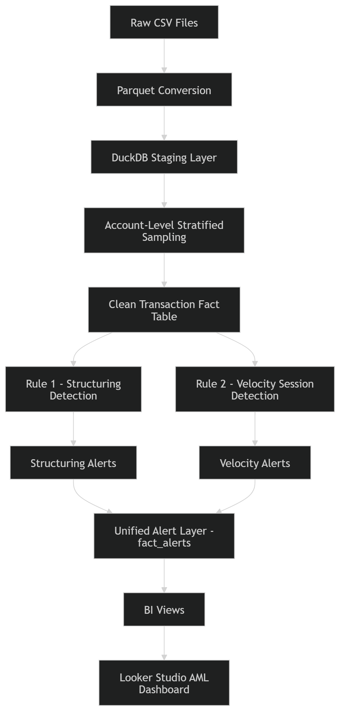

Banking AML Monitoring System
Session-Based Anomaly Detection + Compliance Alert Architecture

Overview
This project implements a scalable Anti-Money Laundering (AML) monitoring system using the IBM “Transactions for Anti Money Laundering (AML)” dataset (~430M transactions).

The system detects suspicious behavioural patterns using:
Rule 1 – Structuring Detection (High Precision)
Rule 2 – Velocity Burst Detection (Session-Based Behavioural Signal)

The project emphasises:
Memory-safe large-scale data processing
Deterministic sessionisation logic
Explainable rule design
Risk band calibration
Compliance-ready alert architecture

## System Architecture

## Dataset
Source: IBM “Transactions for AML” Dataset
Scale: ~430,920,901 transactions

Scenarios Included
HI_LARGE
HI_MEDIUM
HI_SMALL
LI_LARGE
LI_MEDIUM
LI_SMALL

Core Transaction Fields
scenario
time_stamp
from_account
to_account
amount_paid
amount_received
is_laundering
payment_format
payment_currency

Engineering Design Decisions
1️. Parquet Conversion
All CSV files were converted to Parquet to:
Improve columnar query performance
Reduce I/O cost
Enable efficient DuckDB scanning

2️. Schema Separation
Transaction files and account files were separated to avoid schema mismatches during glob reads.
*_Trans.parquet
*_accounts.parquet

3️. Memory-Safe Sampling Strategy
Full 430M-row sessionisation caused out-of-memory errors.
Instead of random row sampling, the system uses:
Account-Level Stratified Sampling (5%)
Deterministic hash-based selection
Preserves full transaction history per sampled account
Maintains laundering rate stability
Reduces dataset to ~20.6M rows

Rule 1 – Structuring Detection
Structuring detection identifies repeated near-threshold transactions

Characteristics:
Daily aggregation
Percentile-based thresholding
Risk band assignment (HIGH / MEDIUM / LOW)
Achieved ~90% precision in HIGH band

This rule acts as a high-confidence deterministic signal.

Rule 2 – Velocity Burst Detection

Why Session-Based?
Rather than rolling windows, the system uses sessionisation:
Transactions ordered per (scenario, from_account)
New session begins after 30-minute inactivity gap
Each session evaluated independently

Velocity Criteria
A session is flagged when:
Duration ≤ 60 minutes
≥ 8 transactions
≥ 3 distinct recipients

Observed Behaviour
Velocity bursts are common in legitimate flows.
Precision at session level was low (~0.14%), indicating:
Velocity alone is weak as a standalone trigger
Behavioural signals require combination with deterministic rules

This reflects real-world AML system design.

Multi-Signal Risk Strategy
To improve practical detection:
✔ Velocity as Risk Multiplier
Session-level bursts are aggregated into account-level risk features.

✔ Percentile-Based Velocity Ranking
Velocity sessions are ranked using PERCENT_RANK() to stabilise HIGH bands.

✔ Layered Detection (Structuring ∩ Velocity)
Accounts flagged by both rules receive elevated combined risk scores.

This mirrors real AML engines where behavioural signals amplify high-confidence rule outputs.

Alert Layer

All alerts integrate into fact_alerts

Fields include:
rule_id
scenario
from_account
risk_score
risk_band
session metrics (for velocity)
structuring metrics (for rule 1)

This unified design supports compliance dashboards and drill-down analysis.

Looker Dashboard (Planned)

The compliance interface will include:
Summary metrics
Risk band distribution
Scenario breakdown
Account drilldown
Transaction timeline view
False-positive analysis

Tech Stack

DuckDB (local analytical engine)
Parquet (columnar storage)
VS Code + Git Bash
Looker (visualisation layer)

Key Takeaways

This project demonstrates:
Large-scale data engineering on commodity hardware
Deterministic sessionisation logic
Statistical validation of sampling
Precision analysis and calibration
Multi-rule risk modelling
Explainable AML architecture

Future Enhancements
Adaptive threshold calibration
Time-decay risk modelling
Network graph analysis
Feature engineering for ML models

Integration with Power BI

Disclaimer
This project is for educational and research purposes using a synthetic AML dataset.

Author
Developed as a portfolio-grade AML monitoring architecture demonstrating scalable detection engineering and risk modelling design.

