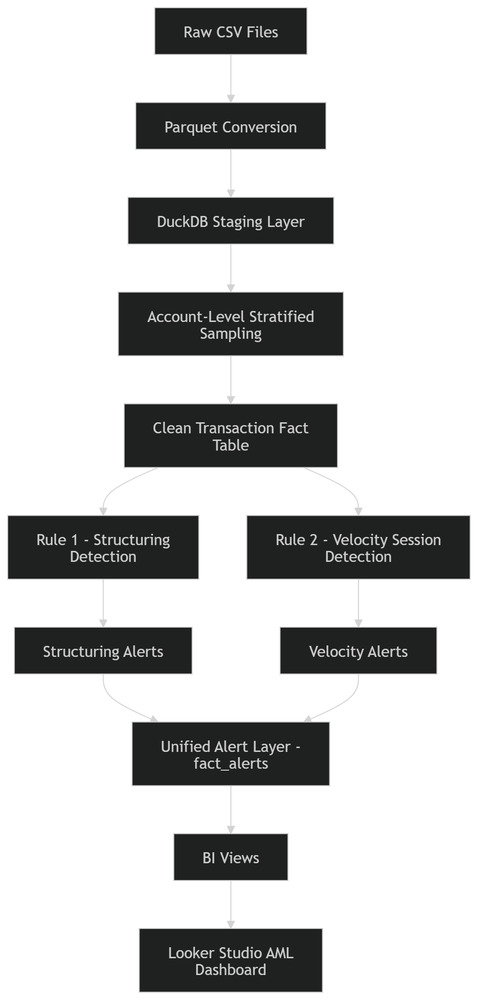

# Banking AML Monitoring System
## Session-Based Anomaly Detection and Compliance Alert Architecture

## Overview
This project implements a scalable Anti-Money Laundering (AML) monitoring system using the IBM “Transactions for Anti Money Laundering (AML)” dataset containing approximately 430 million financial transactions.

#### The system detects suspicious behavioural patterns using two explainable rule-based detection mechanisms:
    Rule 1 – Structuring Detection (High Precision)
    Rule 2 – Velocity Burst Detection (Session-Based Behavioural Signal)

#### The project emphasises:
    Memory-safe large-scale data processing
    Deterministic sessionisation logic
    Explainable rule-based detection
    Behaviour-driven risk scoring
    Compliance-ready alert architecture
    Investigative analytics dashboard

The final system simulates the core components of a real financial institution AML monitoring platform, transforming raw transaction data into actionable intelligence for investigators.

## Dataset
    Source: IBM Synthetic Financial Dataset “Transactions for AML”
    Scale: Approximately 430,920,901 transactions

### Scenarios Included
#### The dataset contains six behavioural transaction scenarios:
    HI_LARGE
    HI_MEDIUM
    HI_SMALL
    LI_LARGE
    LI_MEDIUM
    LI_SMALL
These represent combinations of high / low laundering probability and transaction volume scale.

### Core Transaction Fields
| Field            | Description                         |
| ---------------- | ----------------------------------- |
| scenario         | Synthetic laundering scenario label |
| time_stamp       | Transaction timestamp               |
| from_account     | Sender account                      |
| to_account       | Recipient account                   |
| amount_paid      | Amount sent                         |
| amount_received  | Amount received                     |
| payment_currency | Currency used                       |
| payment_format   | Transfer mechanism                  |
| is_laundering    | Ground-truth laundering label       |

## System Architecture
The AML monitoring system follows a layered architecture transforming raw transaction data into structured alert intelligence.

#### This architecture ensures the system remains:
    Memory efficient
    reproducible
    scalable on commodity hardware
even when analysing hundreds of millions of transactions.

## Engineering Design Decisions
### 1️. Parquet Conversion
All CSV transaction files were converted to Parquet format to improve analytical performance.

#### Benefits include:
    Columnar storage optimisation
    Reduced disk I/O
    Efficient DuckDB vectorised scanning
    Faster analytical queries

### 2️. Schema Separation
#### Transaction and account files were separated to avoid schema mismatches during bulk reads.
    *_Trans.parquet
    *_accounts.parquet
This design ensures stable ingestion when performing glob reads across datasets.

### 3️. Memory-Safe Sampling Strategy
Full 430M-row sessionisation caused out-of-memory errors.
Instead of random row sampling, the system uses:
Account-Level Stratified Sampling
#### Features:
    Deterministic hash-based selection
    Preserves full transaction history per sampled account
    Maintains laundering rate stability
    Maintains behavioural integrity
#### Sampling rate:
    5% of accounts
#### Resulting Dataset:
    Approximately 20.6 million transactions
This approach preserves behavioural patterns while enabling analysis on local hardware.

## Detection Layer
The detection layer applies behavioural rules to identify suspicious transaction patterns.

## Rule 1 – Structuring Detection
Structuring detection identifies high-dispersion transaction behaviour, where funds are distributed across many recipients using repeated smaller transactions.

### Detection Logic:
    Daily aggregation
    Percentile-based thresholds
    Recipient dispersion measurement
    Risk band classification

### Risk Bands:
    High
    Medium
    Low
### Behavioural Indicators
    Large number of distinct recipients
    Repeated outgoing transfers
    Near-threshold transaction sizes
    Rapid distribution of funds
Structuring alerts represent high-confidence deterministic signals.

Observed precision for the HIGH risk band is approximately 6.0%
In real AML systems, this is considered very strong for rule-based detection.

## Rule 2 – Velocity Burst Detection
Velocity detection identifies rapid bursts of transaction activity.

### Why Session-Based Detection?
Rather than rolling windows, the system uses deterministic sessionisation.

#### Session Definition
#### Transactions are grouped per:
    scenerio
    from_account
#### A new session begins when:
    ≥ 30 minutes of inactivity

### Velocity Criteria
#### A session is flagged when:
    Duration ≤ 60 minutes
    ≥ 8 transactions
    ≥ 3 distinct recipients

### Observed Behaviour
Velocity bursts are common in legitimate activity.

#### Precision at session level was low (~0.14%), indicating:
    Velocity alone is weak as a standalone trigger
    Behavioural signals require combination with deterministic rules

## Multi-Signal Risk Strategy
To improve detection effectiveness, the system integrates signals from multiple rules.
#### Velocity as Risk Multiplier
Velocity bursts are converted into session-level behavioural risk signals that increase account-level risk scores.

#### Percentile-Based Velocity Ranking
Velocity sessions are ranked using PERCENT_RANK() to stabilise HIGH risk band classification.

#### Layered Detection (Structuring ∩ Velocity)
Accounts flagged by both rules receive elevated combined risk scores.
This mirrors real AML engines where behavioural signals amplify high-confidence rule outputs.

## Unified Alert Layer
The fact_alerts table functions as a fact table in a star-schema-like structure, with scenario, rule, account, and date acting as logical dimensions. For simplicity and portfolio clarity, dimensions are kept denormalised within the fact layer.

All alerts integrate into fact_alerts table
Fields include:
| Field               | Description               |
| ------------------- | ------------------------- |
| rule_id             | Detection rule identifier |
| scenario            | Dataset scenario          |
| from_account        | Suspicious account        |
| risk_score          | Computed risk score       |
| risk_band           | Risk classification       |
| alert_start         | Alert start timestamp     |
| alert_end           | Alert end timestamp       |
| session metrics     | Velocity features         |
| structuring metrics | Structuring features      |

This unified design supports compliance dashboards and drill-down analysis.

## AML Monitoring Dashboard
The compliance dashboard transforms alert data into an interactive investigation environment.

#### The dashboard follows a four-layer analytical framework:
    Detection
    Evaluation
    Monitoring
    Investigation

## Detection Evaluation
#### The dashboard compares detection rule performance using:
    precision metrics
    behavioural separation analysis
    risk score distributions
This enables evaluation of how effectively each rule identifies suspicious behaviour.

## Monitoring Layer
The monitoring interface tracks suspicious activity patterns.
### Temporal Monitoring
#### A time-series chart visualises alert volumes over time, revealing:
    spikes in suspicious behaviour
    temporal clustering
    potential coordinated activity

### Scenario Analysis
Alerts are analysed across all dataset scenarios to identify how suspicious behaviour manifests under different transaction scales and laundering probabilities.

## Investigation Layer
The investigation layer simulates the workflow used by financial crime analysts.

## Alert Priority Queue
#### Alerts are prioritised based on:
    risk band
    risk score
    alert age
#### Priority categories include:
    Urgent
    High Priority
    Review
    Monitor
This triage mechanism surfaces the most critical alerts for immediate investigation.

## Suspicious Account Network Analysis
The network analysis module reveals relationships between suspicious accounts and recipient accounts.

The analysis displays:
#### source accounts triggering alerts
    recipient accounts receiving funds
    transaction counts between accounts
    total value transferred
    associated risk scores
This allows investigators to identify hub-style accounts distributing funds across large networks, a common laundering pattern.

## Tech Stack
 | Component               | Technology    |
| ----------------------- | ------------- |
| Analytical Engine       | DuckDB        |
| Storage Format          | Parquet       |
| Development Environment | VS Code       |
| Version Control         | Git + GitHub  |
| Visualization           | Looker Studio |

## Key Takeaways
#### This project demonstrates:
    Large-scale data engineering on commodity hardware
    Deterministic behavioural detection algorithms
    Memory-safe transaction sampling
    Explainable AML rule design
    Precision evaluation and calibration
    Multi-rule risk modelling
    Compliance-ready alert architecture
    Investigative analytics dashboard

## Future Enhancements
#### Potential improvements include:
    Adaptive threshold calibration
    Time-decay risk scoring
    Graph-based network analysis
    Feature engineering for Machine Learning models
    Real-time streaming alert pipelines
    Integration with Power BI or operational case management systems

## Disclaimer
This project is for educational and research purposes using a synthetic AML dataset.

## Author
I developed this project as a portfolio-grade AML monitoring architecture demonstrating scalable detection engineering, behavioral analytics and compliance risk modelling.